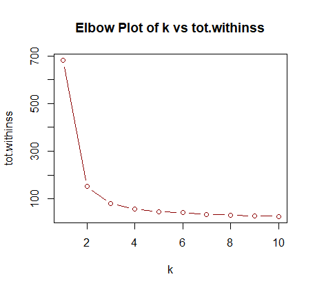

# Clustering Analysis of the Iris Dataset

---

## Clustering the Iris Dataset
### Dataset Overview
The **Iris dataset** consists of 150 samples across three species of flowers: *Setosa, Versicolor, and Virginica*. Each sample contains four attributes:
- Sepal Length
- Sepal Width
- Petal Length
- Petal Width

### Finding the Optimal Number of Clusters (k)
To determine the best k value for clustering, the **elbow method** was used:
```r
# Load dataset
iris_data <- read.table("iris.txt", header = TRUE)

# Determine within-cluster sum of squares for different k values
k_values <- 1:10
wcss <- numeric(length(k_values))

for (i in k_values) {
  model <- kmeans(iris_data[, 1:4], centers = i, nstart = 10)
  wcss[i] <- model$tot.withinss
}

# Plot elbow graph
plot(k_values, wcss, type = "b", main = "Elbow Plot for k Selection", 
     xlab = "Number of Clusters (k)", ylab = "Within-Cluster Sum of Squares", col = "darkred")
```
**Optimal k found: 3**, which aligns with the three species in the dataset.

>


### Evaluating the Best Predictors
To determine the most influential attributes, summary statistics and box plots were used:
```r
# Boxplot of all attributes
boxplot(iris_data[, 1:4], 
        main = "Boxplot of Iris Attributes",
        xlab = "Attribute", 
        ylab = "Value (mm)",
        col = c("lightblue", "pink", "lightgreen", "lightyellow"),
        names = c("Sepal Length", "Sepal Width", "Petal Length", "Petal Width"))
```
#### Observations:
- **Petal Length and Petal Width showed the most variation.**
- **Sepal Width was the least important predictor.**
- Using only petal attributes resulted in higher clustering accuracy compared to using all four attributes.

> 📌 **[Upload Boxplot Image Here]**

### Model Comparisons
#### Baseline Model (All Attributes)
```r
baseline_model <- kmeans(iris_data[, 1:4], centers = 3, nstart = 10)
table(baseline_model$cluster, iris_data$Species)
```
#### Best Model (Petal Length & Petal Width)
```r
pl_pw_model <- kmeans(iris_data[, c(3,4)], centers = 3, nstart = 10)
table(pl_pw_model$cluster, iris_data$Species)
```
**Key Takeaways:**
- **Using only Petal Length & Petal Width improved accuracy.**
- **Including Sepal Width negatively impacted clustering performance.**

> 📌 **[Upload Cluster Comparison Graphs Here]**

---

## Conclusions
- **Study Performance Clustering:**
  - Clusters revealed significant patterns linking rest time and study effectiveness.
  - Further refinement is needed to include engagement levels.

- **Iris Dataset Clustering:**
  - The elbow method confirmed **k = 3** was optimal.
  - **Petal attributes were the strongest predictors.**
  - **Sepal Width reduced model performance.**

### Next Steps
- **For study performance:** Collect additional behavioral data for deeper clustering insights.
- **For the iris dataset:** Test different clustering algorithms (e.g., hierarchical clustering) to compare effectiveness.

---
